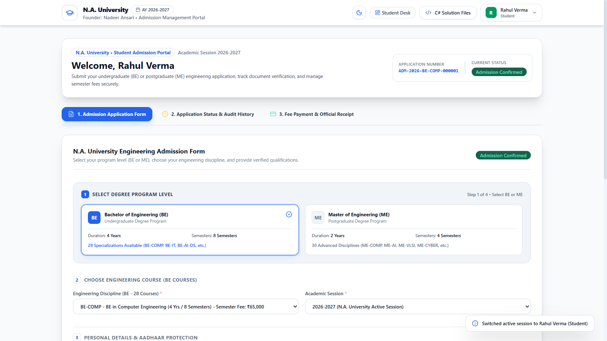
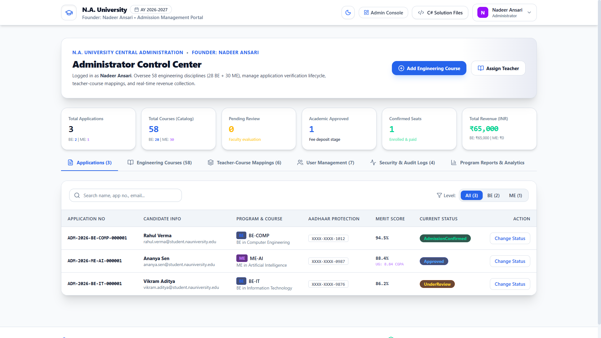
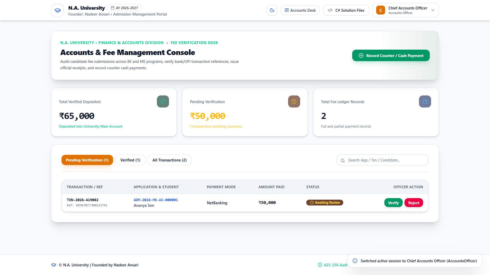
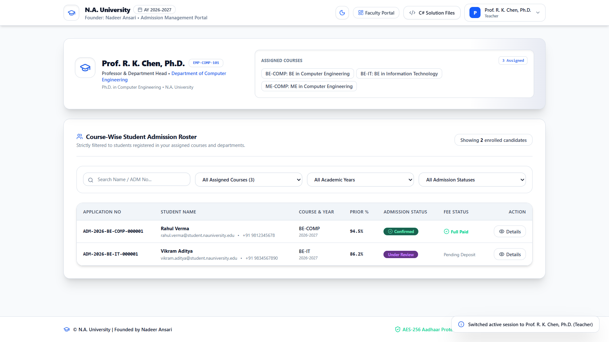
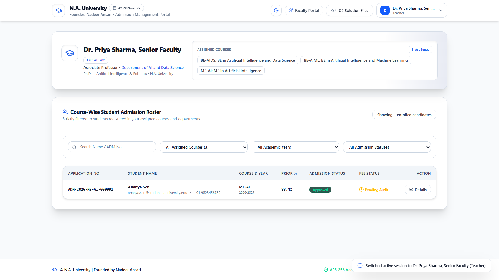
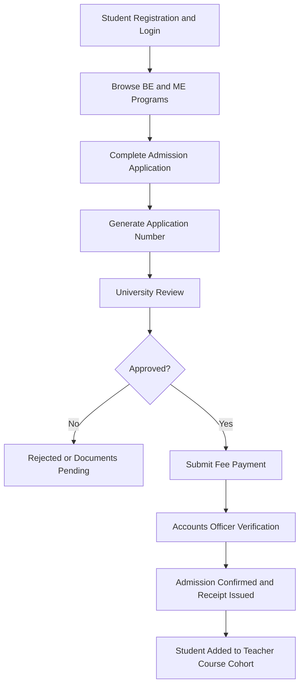

# 🎓 University Admission Management System
### N.A. University Admission Management System

A secure, role-based university admission management web application developed using **ASP.NET Core MVC**.

**Founded by Nadeer Ansari**


---

## 🔗 Project Links

- **Live Application:** [https://uni-admission-portall.ai.studio](https://uni-admission-portall.ai.studio)
- **GitHub Repository:** [View Repository](https://github.com/Nadeer-Ansari/NA-University-Admission-Management-System)

---

> **Demo Notice:** This application uses fictional demonstration data. Do not enter real Aadhaar numbers, financial information, passwords, or other sensitive personal information.

## 📖 Overview

The **N.A. University Admission Management System** is a full-lifecycle university admissions application engineered for **N.A. University**, founded by **Nadeer Ansari**. It streamlines candidate registration, program selection, admission tracking, fee handling, auditing, and academic enrollment verification.

### Core objectives

1. **Automated Admission Workflow:** Move candidates from application submission through fee verification and course-wise teacher allocation.
2. **Role-Based Access Control:** Separate capabilities across Students, Teachers, Accounts Officers, and Administrators.
3. **Sensitive Data Protection:** Demonstrate Aadhaar masking, protected storage concepts, and duplicate-registration checks.
4. **Comprehensive Degree Catalog:** Support 58 engineering specializations across BE and ME programs.
5. **Interactive ASP.NET Core Solution Explorer:** Inspect the included C# architecture and sample project files from within the application.

## 📸 Screenshots

### Student Admission Form and Course Selection



### Administrator Control Center



### Accounts and Fee Management Console



### Faculty Portal — Computer Engineering



### Faculty Portal — Artificial Intelligence



## ✨ Implemented Features

- Secure login interface with role-based demo personas
- Dedicated Student, Teacher, Accounts Officer, and Administrator portals
- 58 engineering programs: 28 Bachelor of Engineering and 30 Master of Engineering specializations
- Deterministic application-number generation
- Admission application form and lifecycle status tracking
- Aadhaar masking and sensitive-data handling demonstrations
- Full and partial fee-payment workflows
- Accounts Officer payment verification
- Printable university fee receipts
- Teacher course-allocation and cohort views
- Administrator controls for courses, fees, users, academic years, and audit logs
- Interactive C# solution explorer with file viewing, copying, and downloads
- Responsive light and dark themes with saved preference

## 👥 User Roles & Access Matrix

| Role | Primary Responsibilities & Access Scope |
| :--- | :--- |
| **Student / Applicant** | Select a BE/ME program, submit an admission application, follow its status, submit fee transactions, and print receipts. |
| **Teacher / Faculty** | View assigned course cohorts and admitted students by course and academic year. |
| **Accounts Officer** | Review fee payments, verify transaction references, and issue official receipts. |
| **Administrator** | Manage courses, academic years, fee structures, user access, applications, and audit logs. |

## 🔄 Admission Workflow



## 🛠️ Technology Stack

| Layer / Category | Technology | Purpose |
| :--- | :--- | :--- |
| **Interactive client** | React 19 and TypeScript | Role dashboards, forms, status views, and modals |
| **Build tooling** | Vite 6 | Development server and optimized production build |
| **Styling** | Tailwind CSS 4 and CSS custom properties | Responsive light/dark interface |
| **Icons and animation** | Lucide React, Motion, Canvas Confetti | UI feedback and visual polish |
| **Backend architecture represented in explorer** | ASP.NET Core 8 MVC and C# 12 | Included solution design and source-code examples |
| **Data architecture represented in explorer** | EF Core 8 and SQL Server | Included persistence models and migration examples |
| **Testing represented in explorer** | xUnit and Moq | Included service and lifecycle test examples |

## 📂 Project Structure

```text
NA-University-Admission-Management-System/
├── docs/
│   └── screenshots/                 # Images used by this README
├── public/
│   └── css/dark-theme.css           # Dark-theme styles
├── src/
│   ├── components/                  # Student, teacher, accounts, and admin portals
│   ├── data/
│   │   ├── initialSeed.ts           # Fictional demonstration records
│   │   ├── csharpProjectFiles.ts    # C# solution files displayed in the explorer
│   │   └── universitySettings.ts
│   ├── hooks/useTheme.ts
│   ├── services/                    # Theme, application number, and data helpers
│   ├── App.tsx
│   ├── index.css
│   ├── main.tsx
│   └── types.ts
├── .env.example
├── .gitignore
├── bun.lock
├── index.html
├── package.json
├── tsconfig.json
└── vite.config.ts
```

## 🚀 Getting Started

### Prerequisites

- Node.js 20 or later
- npm, pnpm, or Bun
- Git

### Clone the repository

```bash
git clone https://github.com/Nadeer-Ansari/NA-University-Admission-Management-System.git
cd NA-University-Admission-Management-System
```

### Install dependencies

Using pnpm:

```bash
corepack pnpm install
```

Or using Bun:

```bash
bun install
```

### Run locally

```bash
corepack pnpm dev
```

Open [http://localhost:3000](http://localhost:3000).

### Validate and build

```bash
corepack pnpm lint
corepack pnpm build
```

The production output is created in `dist/`.

## ⚙️ Configuration

Copy `.env.example` to `.env` only if environment configuration is required. Never commit real API keys or credentials.

```env
GEMINI_API_KEY="MY_GEMINI_API_KEY"
APP_URL="MY_APP_URL"
```

The current interactive admission workflow does not directly call Gemini from the browser.

## 🎨 Theme Support

- **Light theme:** Off-white canvas, white cards, and slate typography
- **Dark theme:** Midnight canvas, dark surface cards, and sapphire/violet accents
- **Instant switching:** Toggle the theme from the navigation bar
- **Persistence:** Theme preference is retained in `localStorage`

## 🔐 Security & Privacy Practices

- Private `.env` files, build output, IDE settings, logs, and local databases are excluded by `.gitignore`.
- Screens and receipts display masked Aadhaar values.
- Demonstration records use fictional profiles.
- Sensitive audit fields are redacted in the interface.
- Real personal or financial information must not be used in the public demo.

## 🔮 Planned Enhancements

- Production ASP.NET Core API and persistent database integration
- Secure server-side authentication and authorization
- Automated email and SMS notifications
- Certificate OCR and document verification
- Payment-gateway webhook integration
- Signed PDF document generation
- Automated unit, integration, and browser tests
- GitHub Actions CI/CD

## 👨‍💻 Author

**Nadeer Ansari**

GitHub: [@Nadeer-Ansari](https://github.com/Nadeer-Ansari)

## 📄 License

This repository does not currently have an open-source license. Add MIT, Apache 2.0, or another license if you want others to reuse the project.
